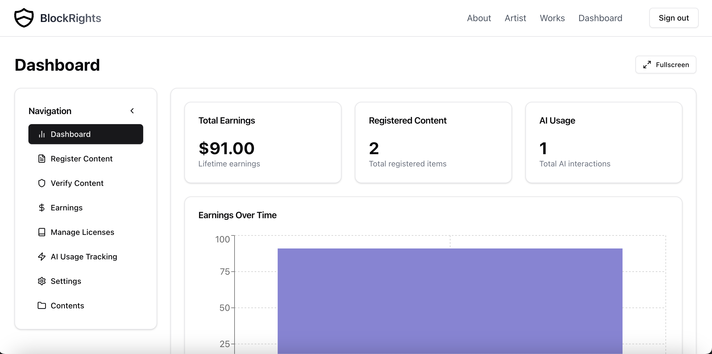
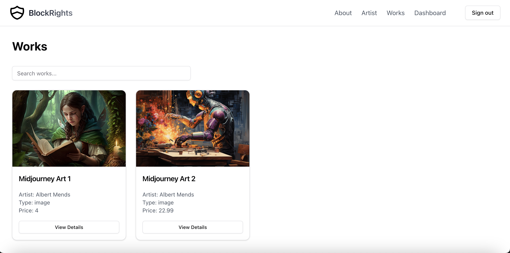
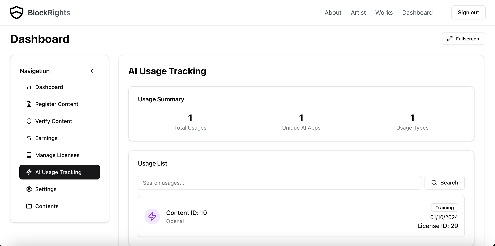
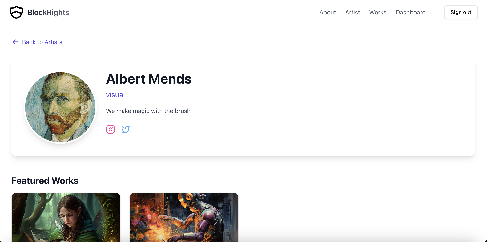

<div align="center">

  
  <h1>Blockrights - Blockchain-Powered Digital Rights Management</h1>
  
  <p>
    A revolutionary platform for managing and protecting digital content rights using blockchain technology.
  </p>

<h4>
    <a href="https://blockrights.io">View Demo</a>
  <span> · </span>
    <a href="https://github.com/mendsalbert/blockrights">Documentation</a>
  <span> · </span>
    <a href="https://github.com/mendsalbert/blockrights/issues/">Report Bug</a>
  <span> · </span>
    <a href="https://github.com/mendsalbert/blockrights/issues/">Request Feature</a>
  </h4>
</div>

<br />

<div align="center">




  
</div>

<br />

<div align="center">
  <p><strong>Contract Address:</strong> 0xE3705927c585e58BBd0F29d2a02E5d158C679832</p>
  
  <a href="https://testnet.bttcscan.com/address/0xE3705927c585e58BBd0F29d2a02E5d158C679832">BTTC Explorer</a>
  </p>
</div>

<br />

# Table of Contents

- [About the Project](#star2-about-the-project)
  - [Tech Stack](#space_invader-tech-stack)
  - [Features](#dart-features)
  - [Environment Variables](#key-environment-variables)
- [Getting Started](#toolbox-getting-started)
  - [Prerequisites](#bangbang-prerequisites)
  - [Installation](#gear-installation)
  - [Running Tests](#test_tube-running-tests)
  - [Run Locally](#running-run-locally)
  - [Deployment](#triangular_flag_on_post-deployment)
- [Usage](#eyes-usage)
- [Roadmap](#compass-roadmap)
- [Contributing](#wave-contributing)
- [License](#warning-license)
- [Contact](#handshake-contact)
- [Acknowledgements](#gem-acknowledgements)

## :star2: About the Project

Blockrights is a cutting-edge platform that leverages blockchain technology to revolutionize digital rights management. It empowers creators and businesses with robust tools to protect their digital assets against unauthorized use and AI misuse. The platform offers secure content registration, smart contract licensing, and automated verification systems.

### :space_invader: Tech Stack

<details>
  <summary>Client</summary>
  <ul>
    <li><a href="https://www.typescriptlang.org/">TypeScript</a></li>
    <li><a href="https://nextjs.org/">Next.js</a></li>
    <li><a href="https://reactjs.org/">React.js</a></li>
    <li><a href="https://tailwindcss.com/">TailwindCSS</a></li>
    <li><a href="https://www.framer.com/motion/">Framer Motion</a></li>
  </ul>
</details>

<details>
  <summary>Server</summary>
  <ul>
    <li><a href="https://www.typescriptlang.org/">TypeScript</a></li>
    <li><a href="https://nextjs.org/">Next.js API Routes</a></li>
    <li><a href="https://orm.drizzle.team/">Drizzle ORM</a></li>
  </ul>
</details>

<details>
<summary>Database</summary>
  <!-- <ul>
    <li><a href="https://neon.tech/">Neon (PostgreSQL)</a></li>
  </ul> -->
</details>

<details>
<summary>Blockchain</summary>
  <ul>
    <li><a href="https://ethereum.org/">Ethereum</a></li>
    <li><a href="https://docs.openzeppelin.com/">OpenZeppelin</a></li>
    <li><a href="https://hardhat.org/">Hardhat</a></li>
    <li><a href="https://ethereum.org/">BTTC</a></li>
  </ul>
</details>

### :dart: Features

- Content Registration: Securely register digital content on the blockchain
- Smart Contract Licensing: Create and manage custom licenses for digital assets
- AI Usage Tracking: Monitor and verify AI usage of registered content
- Automated Payments: Implement automated royalty distribution systems
- User-friendly Dashboard: Manage digital rights and track usage through an intuitive interface
- Multi-user Support: Cater to both individual creators and AI companies
- Blockchain Verification: Verify content authenticity and ownership on-chain

### :key: Environment Variables

To run this project, you will need to add the following environment variables to your `.env` file:

## :toolbox: Getting Started

### :bangbang: Prerequisites

This project uses npm as the package manager:

bash
npm install --global npm

### :gear: Installation

1. Clone the repository:

   ```bash
   git clone https://github.com/mendsalbert/blockrights.git
   ```

2. Install the dependencies:

   ```bash
   cd blockrights
   npm install
   ```

3. Set up the environment variables as described in the previous section.

### :test_tube: Running Tests

To run tests, execute the following command:

bash
npm run test

### :running: Run Locally

To start the development server:

bash
npm run dev

Open [http://localhost:3000](http://localhost:3000) with your browser to see the result.

### :triangular_flag_on_post: Deployment

To build the project for production:

## :eyes: Usage

1. Connect your Web3 wallet to the platform.
2. Register your digital content through the dashboard.
3. Create custom licenses for your content.
4. Monitor AI usage and verify content authenticity.
5. Manage payments and royalties through smart contracts.

## :compass: Roadmap

- [x] Implement basic content registration
- [x] Develop smart contract for licensing
- [x] Create user dashboard
- [ ] Implement token economy for platform governance
- [ ] Enhance AI usage tracking and verification
- [ ] Develop decentralized dispute resolution system

## :wave: Contributing

Contributions are welcome! Please feel free to submit a Pull Request.

1. Fork the Project
2. Create your Feature Branch (`git checkout -b feature/AmazingFeature`)
3. Commit your Changes (`git commit -m 'Add some AmazingFeature'`)
4. Push to the Branch (`git push origin feature/AmazingFeature`)
5. Open a Pull Request

## :warning: License

Distributed under the MIT License. See `LICENSE` for more information.

## :handshake: Contact

Albert Mends - [@mendsalbert](https://twitter.com/mendsalbert) - mendsalbert@gmail.com

Project Link: [https://github.com/mendsalbert/blockrights](https://github.com/mendsalbert/blockrights)

## :gem: Acknowledgements

- [BTTC](https://testnet.bttcscan.com/address/0xE3705927c585e58BBd0F29d2a02E5d158C679832)
- [Privy](https://www.privy.io/)
- [Rainbow Kit](https://www.rainbowkit.com/)
- [Wagmi](https://wagmi.sh/)
- [Lucide Icons](https://lucide.dev/)
- [Drizzle ORM](https://orm.drizzle.team/)
- [Cloudinary](https://cloudinary.com/)
